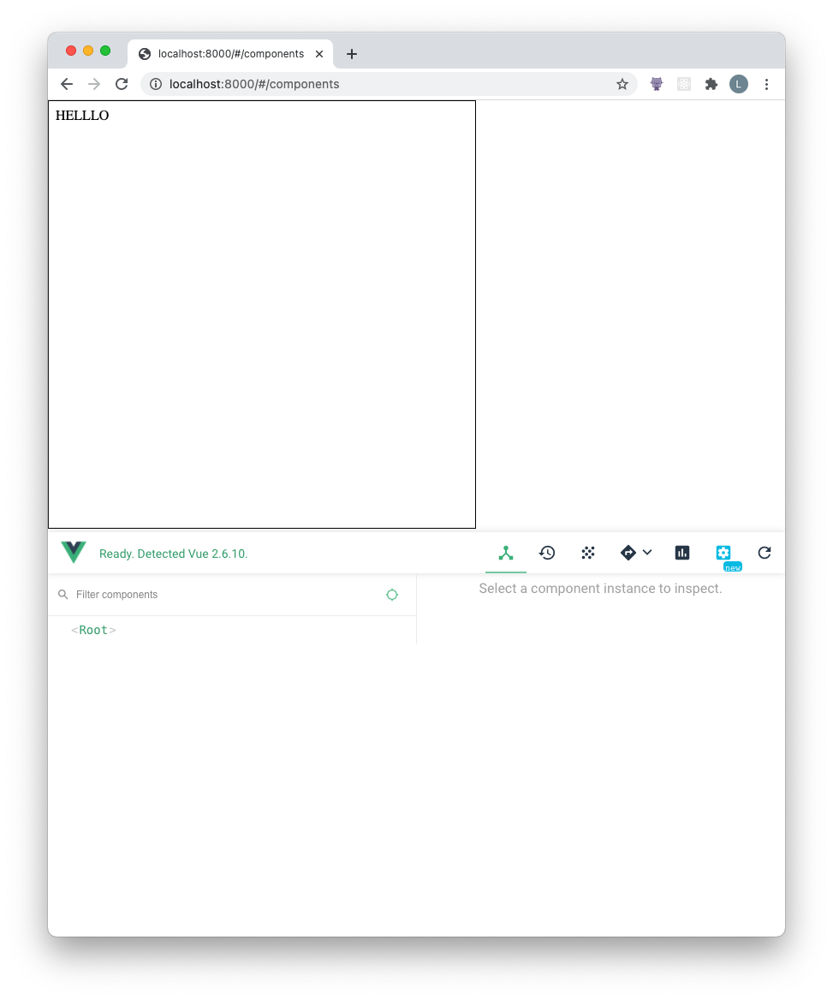

## Inline DevTools

Mount the Vue DevTools inline in a web page, targeting a given `<iframe>`.

## How to use

- `cd packages/inline-devtools`.
- build the package: `yarn build`. It outputs the files to `build`.
- start a static server in `packages/inline-devtools`. I use `python3 -m http.server`.
- visit localhost:8000 (or whatever port you started the server on)
- It should render the devtools inline:

## How it works

We expose an `inlineDevtools` function that takes two args: the element to mount the inline devtools on and the iframe containing the Vue app.

`inlineDevtools` will `eval` the `installHook` function, setting up an event emitted in the `<iframe>`. We then inject the `./backend.js` script which mutates the Vue app, allowing devtools to intercept and monitor things like Vuex, Vue Router and emitted events.
